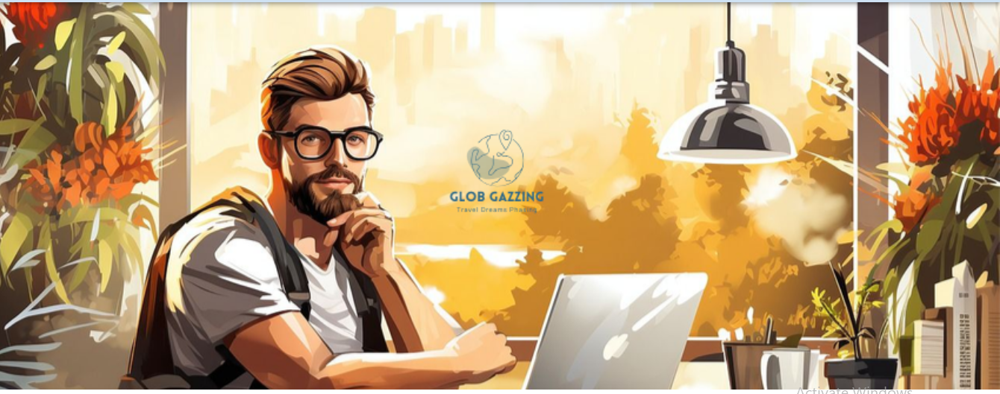
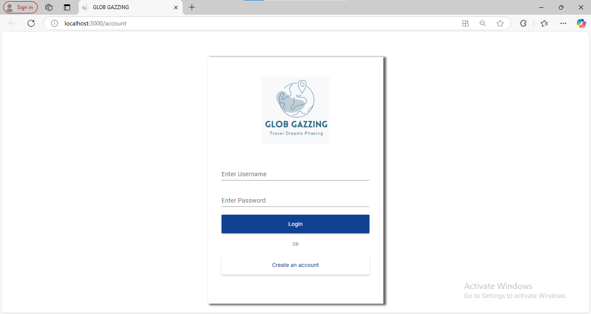
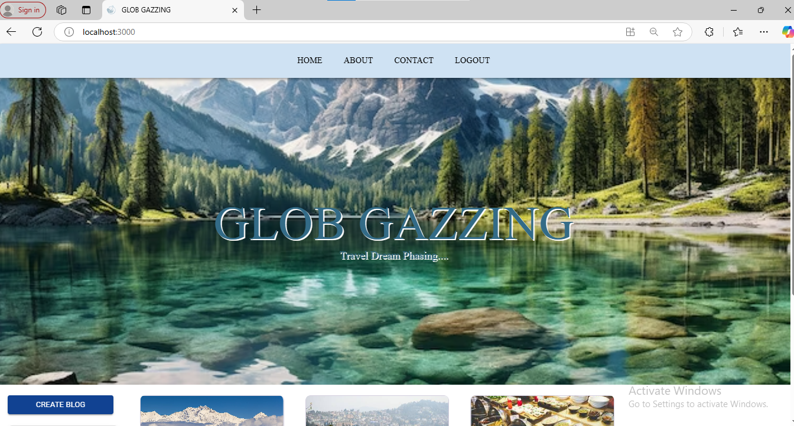
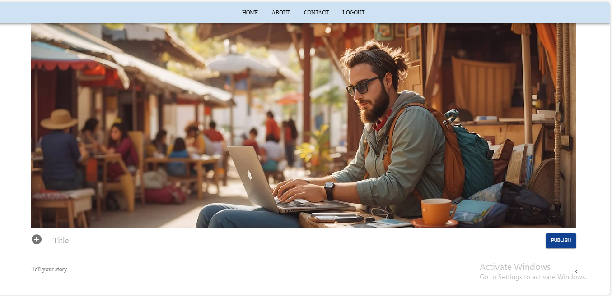
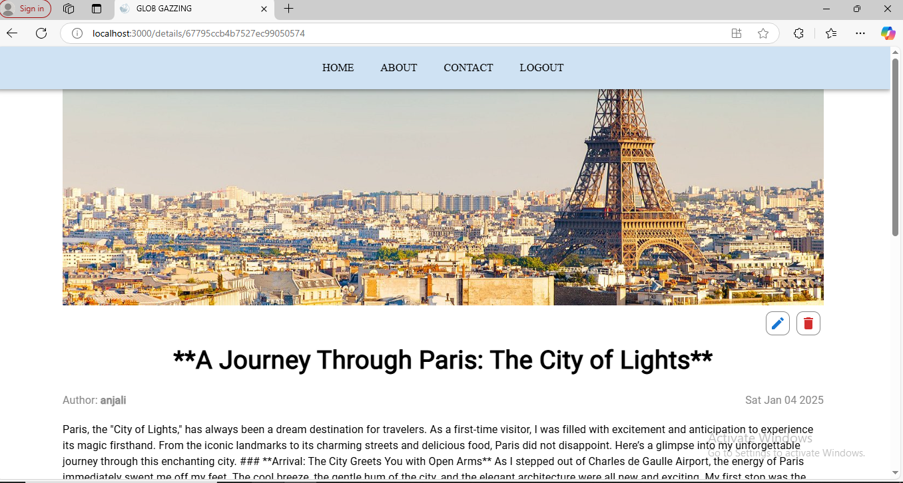
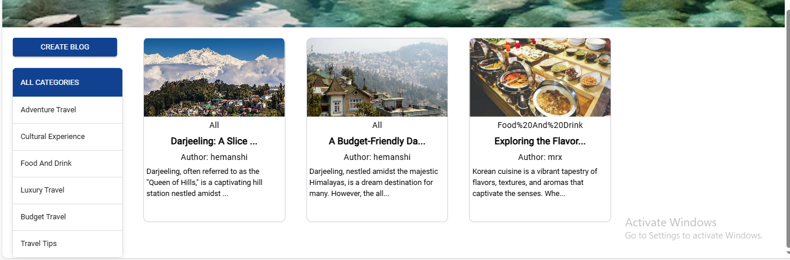
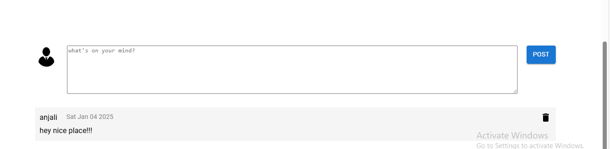
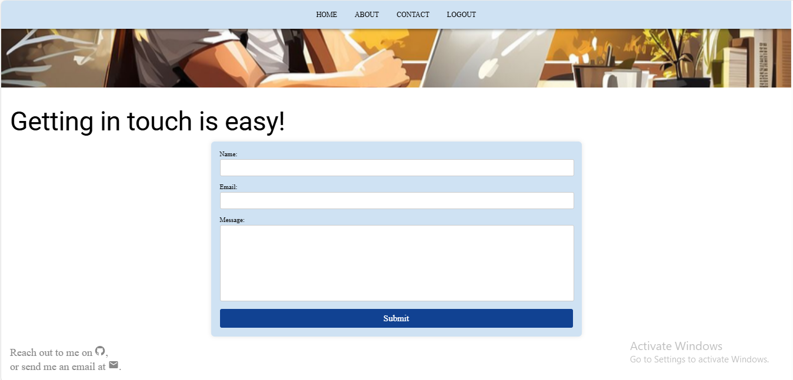

# 🌍 Glob Gazzing

  

Welcome to **Glob Gazzing**, a dynamic and immersive travel blog web application built with the **MERN stack** (MongoDB, Express.js, React, Node.js). Designed for travel enthusiasts, this platform allows users to **share their adventures**, **explore breathtaking destinations**, and **connect with like-minded globetrotters**.

---

## ✨ Features

### 🔒 **User Authentication**
- Secure sign-up and login system using **JWT-based authentication**.

### ✍️ **Rich Content Management**
- Create, edit, and delete blog posts with **multimedia support** (images, videos).

### 💬 **Comment System**
- Engage with the community by adding comments to blog posts.

### 📱 **Responsive Design**
- Fully optimized for **desktop, tablet, and mobile devices**.

### 📱 **Communication Between Users **
- Messeging system for direct interaction via mail or message.
---

## 🛠️ Technologies Used

### **Frontend**
- **React**: Build an interactive and responsive user interface.

### **Backend**
- **Node.js**: JavaScript runtime for building the server.
- **Express.js**: Server-side framework for RESTful API development.

### **Database**
- **MongoDB**: NoSQL database for managing user data and blog entries.

### **Authentication**
- **JWT (JSON Web Token)**: Secure authentication and user authorization.

### **Map Integration**
- **Google Maps API**: To display interactive maps and pin destinations.

---

## 🎯 How It Works

1. **Sign Up & Log In**: Create an account or log in securely using JWT authentication.
2. **Create & Share**: Write detailed travel blogs and enrich them with photos and videos.
3. **Explore Destinations**: Use the interactive map to sort and discover new places.
4. **Engage**: Comment on blogs, ask questions, and connect with fellow travelers.
5. **Contact**:Communicate via messenging system or mail between users.
---

## 📸 Screenshots

### Loginpage
  
*The Login & SignUp page with proper authentication and security for each user.*
<br/><br/>

### Homepage
  
*The welcoming homepage, showcasing featured blogs and destinations.*
<br/><br/>

### Create Blog Post

  
*Easily create , edit and delete your travel blog entries with multimedia support.*
<br/><br/>

### Differentiate via Categories
  
*Easily categories and edit your travel blog entries with categories & filter support.*
<br/><br/>

### Comment Section 
  
*Explore destinations and communicate with users via comments.*
<br/><br/>

### Messenging System for contact 
  
*Message directly to user to explore destinations via queries and communication.*

---

## 🚀 Getting Started

### Prerequisites
- **Node.js** (v14+)
- **MongoDB** (local or cloud-based, e.g., MongoDB Atlas)

### Installation

1. **Clone the Repository**:
   ```bash
   git clone https://github.com/yourusername/glob-gazzing.git
   cd glob-gazzing ```

2. **Install Dependencies**:
   
   ```bash
   # For backend
   cd backend
   npm install

   # For frontend
   cd ../frontend
   npm install ```


3. **Run the Application**:
   
```bash
   # Start backend server
   cd backend
   npm run dev

   # Start frontend development server
   cd ../frontend
   npm start
```

---

## 🌟 Contributing

Contributions are welcome! Please feel free to submit issues or pull requests for enhancing the platform.  give me an upgraded readme file with screenshots

